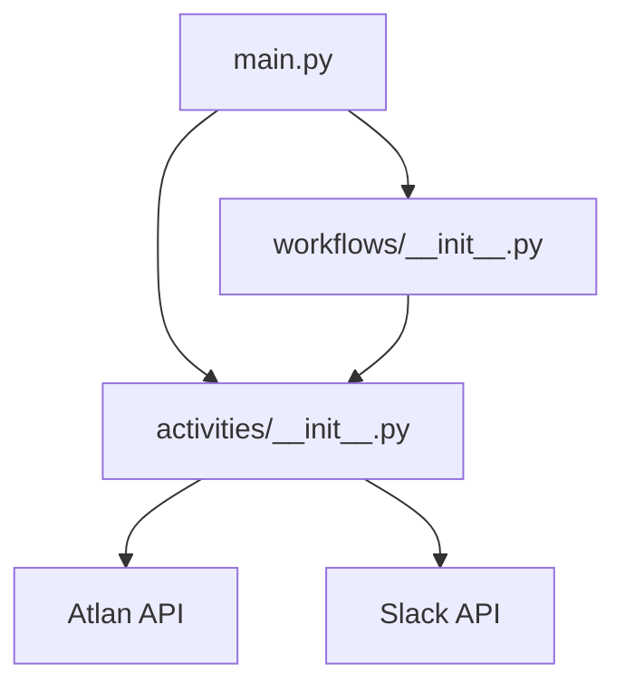

# 📝 Asset Description Reminder

A powerful application that helps maintain data quality by reminding asset owners to add descriptions to their assets through Slack messages. Built with Application SDK for automated monitoring and notifications.

https://github.com/user-attachments/assets/61cd20b0-a734-4815-910f-8565c9daa727

## Prerequisites

- Python 3.11+
- [uv](https://docs.astral.sh/uv/) package manager
- [Dapr CLI](https://docs.dapr.io/getting-started/install-dapr-cli/)
- [Temporal CLI](https://docs.temporal.io/cli)
- Atlan instance access and API key
- Slack bot token

### Installation Guides
- [macOS Setup Guide](https://github.com/atlanhq/application-sdk/blob/main/docs/docs/setup/MAC.md)
- [Linux Setup Guide](https://github.com/atlanhq/application-sdk/blob/main/docs/docs/setup/LINUX.md)  
- [Windows Setup Guide](https://github.com/atlanhq/application-sdk/blob/main/docs/docs/setup/WINDOWS.md)

## Quick Start


1. **Download required components:**
   ```bash
   uv run poe download-components
   ```

2. **Set up environment variables (see Configuration below)**

3. **Start dependencies (in separate terminal):**
   ```bash
   uv run poe start-deps
   ```

4. **Run the application:**
   ```bash
   uv run main.py
   ```

**Access the application:**
- **Web Interface**: http://localhost:8000
- **Temporal UI**: http://localhost:8233

## Features

- Tenant User Management: Fetch and display list of users in your Atlan tenant
- Asset Discovery: Find up to 50 assets owned by a selected user
- Description Validation: Identify assets missing descriptions
- Slack Integration: Send personalized reminder messages via Slack DM
- Web Interface: User-friendly frontend for selecting users and triggering workflows
- Workflow Management: Leverages Application SDK for robust workflow orchestration
- API Integration: HTTP endpoints for triggering checks and integration

### Configuration

The application is configured through the web interface where you need to provide:

- Atlan Base URL: Your Atlan instance URL (e.g., https://your-tenant.atlan.com)
- Atlan API Key: Your API key for authentication
- Slack Bot Token: Your Slack bot's OAuth token

Additionally, set this environment variable to specify who receives the Slack reminders:

```env
SLACK_USER_EMAIL=manager@company.com  # Email of the Slack user who will receive reminders
```

This allows you to:

- Send reminders to team leads/managers instead of asset owners
- Centralize notifications to a specific user
- Route reminders through a designated point of contact

To obtain your Atlan API key:

1. Log in to your Atlan instance
2. Follow the instructions in the [API Authentication Guide](https://ask.atlan.com/hc/en-us/articles/8312649180049-API-authentication)
3. Copy the generated API key

### Slack Bot Setup

1. Go to [Slack API](https://api.slack.com/apps) and create a new app
2. Navigate to "OAuth & Permissions"
3. Add the following scopes:
   - chat:write - Send messages
   - users:read - Get user information
   - channels:read - Access channel information
4. Install the app to your workspace
5. Copy the Bot User OAuth Token (starts with xoxb-)

## Development

### Stop Dependencies
```bash
uv run poe stop-deps
```

### Run Tests
```bash
uv run pytest
```

## Project Structure



```
asset_descriptor_reminder/
├── components/         # Dapr components (auto-downloaded)
├── app/
│   ├── activities/     # Task implementations
│   ├── application/    # Application setup
│   ├── clients/        # API clients
│   └── workflows/      # Workflow definitions
├── frontend/           # Frontend assets
│   ├── static/        # Static files (CSS, JS)
│   └── templates/     # HTML templates
├── main.py            # Application entry point
├── pyproject.toml     # Dependencies and config
└── README.md          # This file
```

## Workflow Process

1. Initialization: Application sets up workflow components and API server
2. User Selection: User selects a target user from the web interface
3. Asset Discovery:
   - Fetches up to 50 assets owned by selected user
   - Identifies assets missing descriptions
4. Slack Integration:
   - Looks up designated Slack user (from SLACK_USER_EMAIL)
   - Sends personalized reminder message
5. Monitoring: Tracks message delivery and user responses

### Example Slack Message

```
👋 Hi John! I noticed that some of your assets in Atlan are missing descriptions.

Asset: Customer Data Table
Type: Table
Owner: john.doe

Adding a description helps others understand the purpose and contents of this asset.
Would you mind adding one when you get a chance?
```

## Learning Resources

- [Atlan Application SDK Documentation](https://github.com/atlanhq/application-sdk/tree/main/docs)
- [FastAPI Documentation](https://fastapi.tiangolo.com/)
- [Temporal Documentation](https://docs.temporal.io/)
- [Slack API Documentation](https://api.slack.com/docs)

## Contributing

We welcome contributions! Please feel free to submit a Pull Request.
