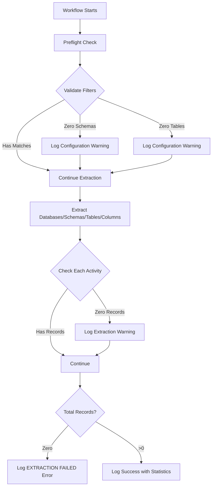

# Zero Metadata Records - Troubleshooting Guide

## Overview

This document explains the zero metadata extraction issue and how the MySQL connector now handles and reports it.

## Problem Description

MySQL workflows can fail during extraction when **zero metadata records** are returned from the source. This typically occurs when:

1. **Misconfigured Include/Exclude Filters**: The regex patterns don't match any actual schemas/tables in the database
2. **Empty Source Database**: The database contains no user schemas (only system schemas)
3. **Incorrect Database Connection**: The workflow is connected to the wrong MySQL instance
4. **Over-restrictive temp-table-regex**: Table name filters exclude all tables

## Solution Implementation

### 1. Preflight Validation (activities.py)

The `preflight_check` activity now validates filter configuration **before** extraction begins:

```python
async def preflight_check(self, workflow_args: Dict[str, Any]) -> Optional[ActivityStatistics]:
    """Enhanced preflight check that validates filter configuration."""
```

**What it does:**
- Runs the configured filters against the source database
- Counts how many schemas and tables match
- Logs **CONFIGURATION WARNING** if zero matches are found
- Provides detailed filter information for debugging

**Example Warning Log:**
```
CONFIGURATION WARNING: Include/exclude filters match ZERO schemas.
This extraction will produce no metadata.
Please review your filter configuration.
```

### 2. Post-Extraction Validation (activities.py)

Each extraction activity now validates its results:

- `fetch_databases()` - Warns if zero databases extracted
- `fetch_schemas()` - Warns if zero schemas extracted  
- `fetch_tables()` - Warns if zero tables extracted
- `fetch_columns()` - Warns if zero columns extracted

**Example Warning Log:**
```
EXTRACTION WARNING: Zero tables extracted.
This may indicate misconfigured filters or an empty source database.
```

### 3. Workflow-Level Validation (workflows.py)

The workflow now:
- Collects statistics from all extraction activities
- Calculates total records extracted
- Logs **EXTRACTION FAILED** error if zero total records
- Provides comprehensive diagnostic information

**Example Error Log:**
```
EXTRACTION FAILED: Zero metadata records extracted across all activities.
This is likely a configuration issue.
Common causes:
1) Include/exclude filters don't match any schemas/tables in the source
2) Source database is empty or contains only system schemas
3) Incorrect database connection or credentials pointing to wrong instance
```

## Diagnostic Flow



## How to Use the Diagnostics

### 1. Check Preflight Warnings

Before extraction starts, look for:
```
Filter validation results:
  schema_count: 0
  table_count: 0
```

This indicates your filters won't match anything.

### 2. Review Filter Configuration

Check your workflow configuration:
- `include_filter`: Should match your target schemas
- `exclude_filter`: Shouldn't exclude everything
- `temp-table-regex`: Shouldn't exclude all tables

### 3. Verify Database Content

Ensure your source database has non-system schemas:
- MySQL automatically excludes: `information_schema`, `performance_schema`, `mysql`, `sys`
- Check if you have user schemas using: `SHOW DATABASES;`

### 4. Examine Extraction Warnings

If extraction proceeds but returns zero records, check individual activity warnings:
```
EXTRACTION WARNING: Zero schemas extracted.
```

### 5. Review Final Error

If all activities return zero records:
```
EXTRACTION FAILED: Zero metadata records extracted across all activities.
```

Review the included diagnostic information:
- Filter configuration
- Per-activity statistics
- Database connection details

## Common Scenarios

### Scenario 1: Too Restrictive Include Filter

**Problem:**
```json
{
  "include_filter": "{\"^mydb$\": [\"^nonexistent_schema$\"]}"
}
```

**Solution:**
- Verify schema names exist: `SELECT SCHEMA_NAME FROM INFORMATION_SCHEMA.SCHEMATA;`
- Adjust filter to match actual schema names

### Scenario 2: Exclude Filter Blocks Everything

**Problem:**
```json
{
  "exclude_filter": "{\"^.*$\": [\"^.*$\"]}"
}
```

**Solution:**
- Remove or adjust exclude filter to be more specific
- Exclude filters should target specific schemas, not wildcards

### Scenario 3: Empty Database

**Problem:**
Database only contains system schemas.

**Solution:**
- Create user schemas with tables
- Or connect to a different database instance

### Scenario 4: Wrong Database Instance

**Problem:**
Connected to test/dev instead of production.

**Solution:**
- Verify connection host, port, and database name
- Check credentials are for the correct instance

## Filter Pattern Examples

### Good Pattern: Specific Schema
```json
{
  "include_filter": "{\"^def$\": [\"^my_app_schema$\", \"^my_data_schema$\"]}",
  "exclude_filter": "{}"
}
```

### Good Pattern: Wildcard with Prefix
```json
{
  "include_filter": "{\"^def$\": [\"^prod_.*$\"]}",
  "exclude_filter": "{\"^def$\": [\"^prod_test.*$\"]}"
}
```

### Bad Pattern: Too Restrictive
```json
{
  "include_filter": "{\"^exact_match_only$\": [\"^exact_schema_only$\"]}",
  "exclude_filter": "{}"
}
```

## Integration with Monitoring

The enhanced logging integrates with:
- **Application SDK Observability**: All logs include structured metadata
- **Temporal UI**: View warnings and errors in workflow history
- **Metrics**: Track zero-record extractions across workflows

## Testing the Solution

To test if the solution works:

1. **Test with Empty Filters** (should extract all non-system schemas)
2. **Test with Invalid Filters** (should log warnings during preflight)
3. **Test with Valid Filters** (should succeed with positive record counts)

## Related Files

- `/workspace/connectors/mysql/app/activities.py` - Activity-level validation
- `/workspace/connectors/mysql/app/workflows.py` - Workflow-level validation
- `/workspace/connectors/mysql/app/sql/tables_check.sql` - Table count query
- `/workspace/connectors/mysql/app/sql/extract_schema.sql` - Schema extraction with filters

## Support

For additional help:
1. Review workflow logs in Temporal UI
2. Check application logs for detailed error messages
3. Verify database connectivity and permissions
4. Consult the main README.md for setup instructions
