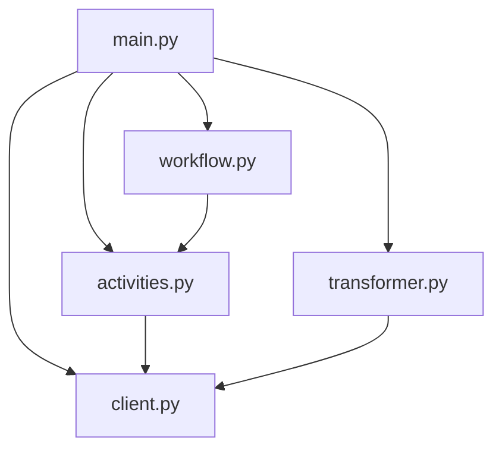

# 🗃️ MySQL App

A powerful application that extracts metadata from MySQL databases and transforms it into a standardized format. Built with Application SDK for robust workflow management.

## Features

- Automated metadata extraction from MySQL databases
- Structured workflow for database, schema, table, and column extraction
- Real-time workflow status tracking
- Robust error handling and retry mechanisms
- Standardized metadata transformation

## Usage

> [!NOTE]
> To run, first see [README.md](../README.md) for prerequisites.

### Run the MySQL Application
Run the application in the main terminal:
```bash
uv run main.py
```

### Access the Application

Once the application is running:

-   **Web Interface**: Open your browser and go to `http://localhost:8000` (or the port configured for `APP_HTTP_PORT`).
-   **Temporal UI**: Access the Temporal Web UI at `http://localhost:8233` (or your Temporal UI address) to monitor workflow executions.

## Project Structure



```
mysql/
├── main.py           # Application entry point and initialization
├── workflow.py       # Workflow definitions and orchestration
├── activities.py     # Database interaction activities
├── transformer.py    # Metadata transformation logic
├── client.py         # MySQL client implementation
├── models/           # Data models and schemas
├── app/sql/          # SQL query templates
└── frontend/         # Web interface assets
```

> [!NOTE]
> Make sure you have a `.env` file that matches the [.env.example](.env.example) file in this directory.

## Workflow Process

1. **Initialization**: The application sets up the SQL client and workflow components
2. **Preflight Check**: Validates database connectivity and permissions
3. **Metadata Extraction**:
   - Fetches database information
   - Extracts schema details
   - Retrieves table metadata
   - Gathers column information
4. **Transformation**: Converts raw metadata into standardized format
5. **Output**: Saves the transformed metadata to specified location


## Learning Resources

- [Atlan Application SDK Documentation](https://github.com/atlanhq/application-sdk/tree/main/docs)
- [MySQL Documentation](https://dev.mysql.com/doc/)
- [Python FastAPI Documentation](https://fastapi.tiangolo.com/)

## Contributing

We welcome contributions! Please feel free to submit a Pull Request.
