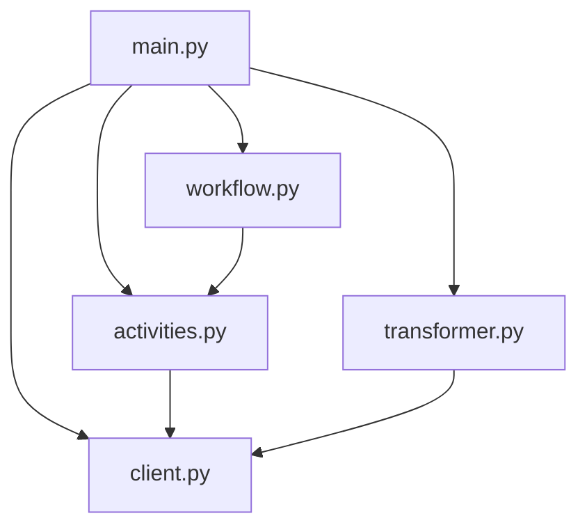

# 🗃️ MySQL App

A powerful application that extracts metadata from MySQL databases and transforms it into a standardized format. Built with Application SDK for robust workflow management.

## 🌟 Features

- Automated metadata extraction from MySQL databases
- Structured workflow for database, schema, table, and column extraction
- Real-time workflow status tracking
- Robust error handling and retry mechanisms
- Standardized metadata transformation

## 🚀 Quick Start

### Prerequisites

- [uv](https://docs.astral.sh/uv/getting-started/installation/)
- Python 3.11.10
- MySQL database access

### Installation

1. Install Python 3.11.10 using uv:
```bash
uv python install 3.11.10
```

2. Install dependencies:
```bash
uv sync --group mysql
```

### Running the Application

1. Start the dependencies in a separate terminal:
```bash
poe download-components
poe start-deps
```

2. Run the application in the main terminal:
```bash
uv run main.py
```

3. Access the application:
   - Web Interface: Navigate to `http://localhost:8000` in your browser
   - Workflow Output: Check `/tmp/dapr/objectstore` for extracted metadata files

## 📁 Project Structure



```
mysql/
├── main.py           # Application entry point and initialization
├── workflow.py       # Workflow definitions and orchestration
├── activities.py     # Database interaction activities
├── transformer.py    # Metadata transformation logic
├── client.py         # MySQL client implementation
├── models/           # Data models and schemas
├── app/sql/          # SQL query templates
└── frontend/         # Web interface assets
```

## 🔄 Workflow Process

1. **Initialization**: The application sets up the SQL client and workflow components
2. **Preflight Check**: Validates database connectivity and permissions
3. **Metadata Extraction**:
   - Fetches database information
   - Extracts schema details
   - Retrieves table metadata
   - Gathers column information
4. **Transformation**: Converts raw metadata into standardized format
5. **Output**: Saves the transformed metadata to specified location

## 🛠️ Configuration

Copy the example environment file and update it with your MySQL connection details:

```bash
cp .env.sample .env
```

Update the `.env` file with your MySQL connection details:


## 📚 Learning Resources

- [Atlan Application SDK Documentation](https://github.com/atlanhq/application-sdk/tree/main/docs)
- [MySQL Documentation](https://dev.mysql.com/doc/)
- [Python FastAPI Documentation](https://fastapi.tiangolo.com/)

## 🤝 Contributing

We welcome contributions! Please feel free to submit a Pull Request.
