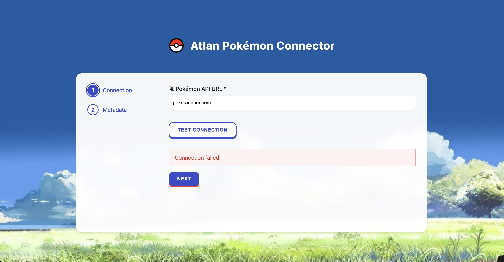
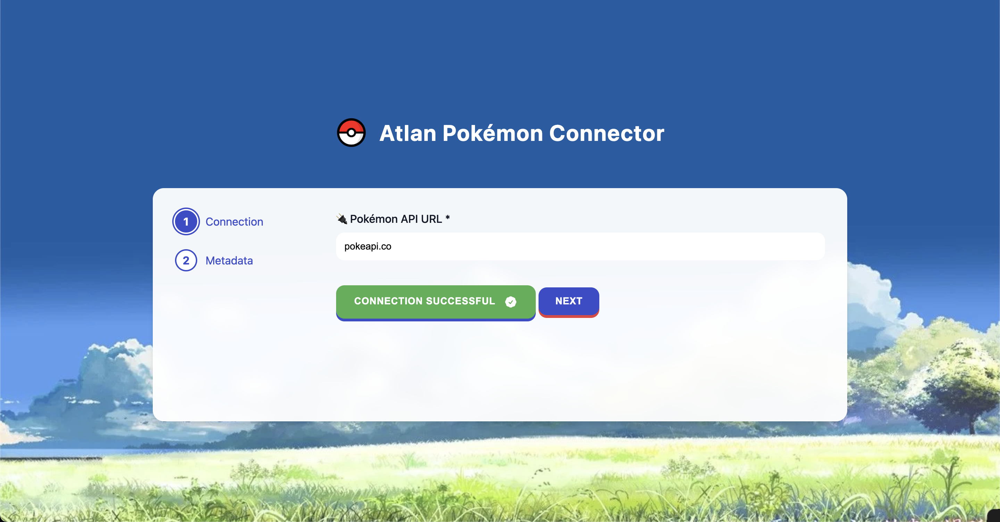
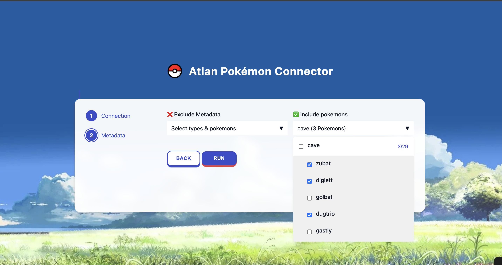
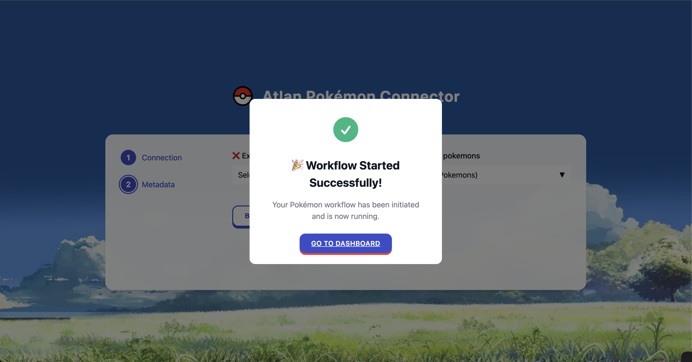
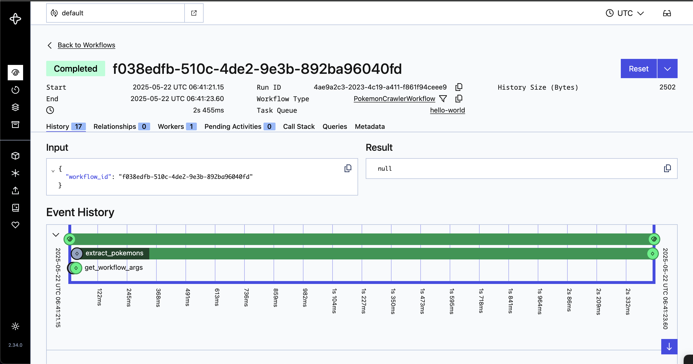
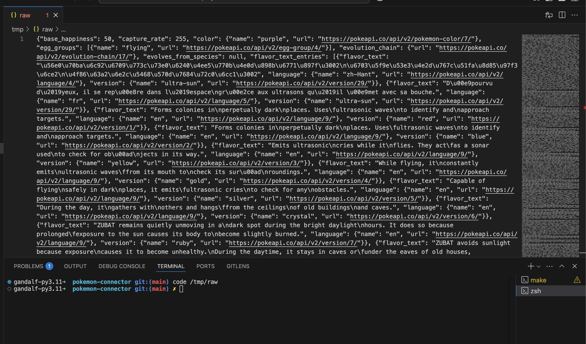

# Atlan Poké extractor app

Go 'extract' them all

## Features

- Fetches Pokémon data from PokéAPI (pokeapi.co)
- Include exclude filters
- Test auth
- Modern, responsive UI with Pokémon-themed styling

## Project Structure

```
pokemon-connector/
├── app/                 # Backend application code
│   ├── workflows/       # Temporal workflow defition for poke connector
│   ├── activities/      # Temporal activities
│   └── handlers/        # Api handlers
├── frontend/            # Frontend code
│   ├── static/          # Static assets (CSS, JS, images)
│   └── templates/       # HTML templates
├── main.py              # Application entry point
├── pyproject.toml       # Poetry dependencies
├── poetry.lock          # Locked dependencies
├── Dockerfile           # Main application Dockerfile
├── Dockerfile.Agent     # Agent Dockerfile
├── docker-compose.yaml  # Docker compose configuration
└── Makefile             # Build and development commands
```

## Getting Started

### Prerequisites

- Python 3.8+
- Poetry (for Python dependency management)

### Installation

1. Clone the repository:
   ```bash
   git clone https://github.com/yourusername/pokemon-connector.git
   cd pokemon-connector
   ```

2. Install dependencies using Poetry:
   ```bash
   make install
   ```

3. Run the application:
   ```bash
   make run-dev
   ```

4. open localhost:8000 to see the app UI

## Screenshots






