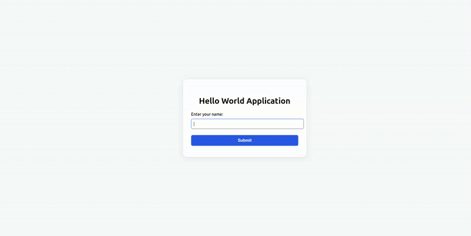

# 👋 Hello World

A simple starter application demonstrating how to build apps with Application SDK.



## Prerequisites

- Python 3.11+
- [uv](https://docs.astral.sh/uv/) package manager
- [Dapr CLI](https://docs.dapr.io/getting-started/install-dapr-cli/)
- [Temporal CLI](https://docs.temporal.io/cli)

### Installation Guides
- [macOS Setup Guide](https://github.com/atlanhq/application-sdk/blob/main/docs/docs/setup/MAC.md)
- [Linux Setup Guide](https://github.com/atlanhq/application-sdk/blob/main/docs/docs/setup/LINUX.md)
- [Windows Setup Guide](https://github.com/atlanhq/application-sdk/blob/main/docs/docs/setup/WINDOWS.md)

## Quick Start

1. **Download required components:**
   ```bash
   uv run poe download-components
   ```

2. **Start dependencies (in separate terminal):**
   ```bash
   uv run poe start-deps
   ```

3. **Run the application:**
   ```bash
   uv run main.py
   ```

**Access the application:**
- **Web Interface**: http://localhost:8000
- **Temporal UI**: http://localhost:8233

## Features
- Simple web interface to input your name
- Real-time workflow status tracking
- Integration with Temporal for workflow management
- Demonstrates async and sync activities in workflows

## Development

### Stop Dependencies
```bash
uv run poe stop-deps
```

### Run Tests
```bash
uv run pytest
```

### Project Structure
```
hello_world/
├── app/                # Core application logic
│   ├── activities.py   # Workflow activities
│   └── workflow.py     # Workflow definitions
├── frontend/           # Frontend assets
│   ├── static/        # Static files (CSS, JS)
│   └── templates/     # HTML templates
├── local/              # Local data storage
├── deploy/            # Installation and deployment files
├── tests/              # Test files
├── main.py            # Application entry point
├── pyproject.toml     # Dependencies and config
└── README.md          # This file
```

## Learning Resources
- [Temporal Documentation](https://docs.temporal.io/)
- [Atlan Application SDK Documentation](https://github.com/atlanhq/application-sdk/tree/main/docs)
- [Python FastAPI Documentation](https://fastapi.tiangolo.com/)

> [!TIP]
> Want to containerize this app? See the [Build Docker images](https://github.com/atlanhq/atlan-sample-apps/tree/main/README.md#build-docker-images) section in the repository root README for unified build and run instructions.

## Contributing
We welcome contributions! Please feel free to submit a Pull Request.