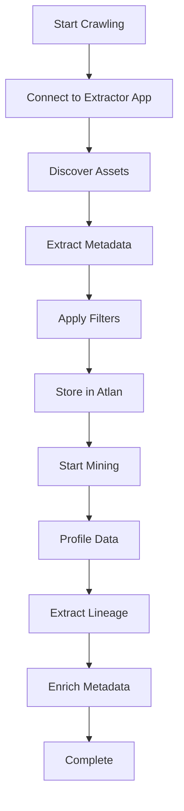

# Crawling

This section covers the metadata extraction and crawling processes for your [EXTRACTOR_APP_NAME] connector. Learn how to configure, run, and optimize metadata discovery and extraction.

## Overview

The crawling process consists of two main phases:

1. **Crawling**: Discovery and extraction of metadata from your [EXTRACTOR_APP_NAME] instance
2. **Mining**: Extracting queries and enriching the extracted metadata for better searchability and insights (like asset popularity, data quality, etc.)

## Crawling Guides

### 1. [Crawl Extractor App](./crawl-extractor-app.md)

Comprehensive guide to configuring and running metadata extraction from your [EXTRACTOR_APP_NAME] instance.

**What you'll learn:**

- How to configure crawling parameters
- Scheduling and automation options
- Performance optimization techniques
- Filtering and inclusion/exclusion rules

### 2. [Mine Extractor App](./mine-extractor-app.md)

Learn how to process and enrich the crawled metadata for enhanced discovery and insights.

**What you'll learn:**

- Metadata processing workflows
- Data profiling and quality assessment
- Lineage extraction and mapping
- Custom metadata enrichment

## Crawling Workflow

## Key Concepts

### Metadata Types

The crawler extracts various types of metadata:

- **Structural Metadata**: Tables, columns, schemas, databases
- **Descriptive Metadata**: Comments, descriptions, tags
- **Operational Metadata**: Usage statistics, performance metrics
- **Lineage Metadata**: Data flow and transformation relationships

### Crawling Modes

- **Full Crawl**: Complete metadata extraction (initial setup)
- **Incremental Crawl**: Extract only changes since last crawl
- **Selective Crawl**: Extract specific assets or schemas
- **On-Demand Crawl**: Manual crawling for specific requirements

## Best Practices

### Performance Optimization

- **Schedule During Off-Peak Hours**: Minimize impact on production systems
- **Use Incremental Crawling**: Reduce processing time for subsequent runs
- **Optimize Connection Pooling**: Configure appropriate connection limits
- **Monitor Resource Usage**: Track CPU, memory, and network utilization

### Data Quality

- **Validate Metadata**: Ensure extracted metadata is accurate and complete
- **Handle Schema Changes**: Configure crawling to detect and adapt to schema evolution
- **Error Handling**: Implement robust error handling and retry mechanisms
- **Data Freshness**: Balance crawling frequency with system performance

## Monitoring and Troubleshooting

### Key Metrics to Monitor

- **Crawling Duration**: Time taken for each crawling run
- **Success Rate**: Percentage of successful asset extractions
- **Error Rate**: Number of failed extractions or connections
- **Data Volume**: Amount of metadata extracted per run

### Common Issues

- **Connection Timeouts**: Network or authentication issues
- **Permission Errors**: Insufficient access rights
- **Memory Issues**: Large datasets causing resource constraints
- **Schema Changes**: Structural changes affecting extraction

## Next Steps

After understanding the crawling process:

1. Review [what Atlan crawls](../references/what-does-atlan-crawl.md) from your extractor app
2. Check [preflight requirements](../references/preflight-checks.md) before starting
3. Consult [troubleshooting guides](../troubleshooting/) if you encounter issues
