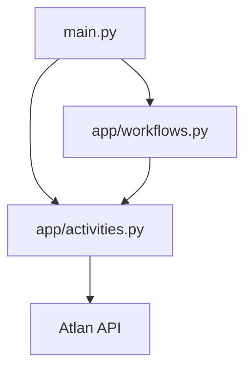

# 🕒 Freshness Monitor

A powerful application that monitors data freshness across your data assets and automatically flags stale data. Built with Application SDK for automated freshness checks and reporting.

## Prerequisites

- Python 3.11+
- [uv](https://docs.astral.sh/uv/) package manager
- [Dapr CLI](https://docs.dapr.io/getting-started/install-dapr-cli/)
- [Temporal CLI](https://docs.temporal.io/cli)
- Atlan instance access and API key

### Installation Guides
- [macOS Setup Guide](https://github.com/atlanhq/application-sdk/blob/main/docs/docs/setup/MAC.md)
- [Linux Setup Guide](https://github.com/atlanhq/application-sdk/blob/main/docs/docs/setup/LINUX.md)
- [Windows Setup Guide](https://github.com/atlanhq/application-sdk/blob/main/docs/docs/setup/WINDOWS.md)

## Quick Start

1. **Download required components:**
   ```bash
   uv run poe download-components
   ```

2. **Set up environment variables (see below)**

3. **Start dependencies (in separate terminal):**
   ```bash
   uv run poe start-deps
   ```

4. **Run the application:**
   ```bash
   uv run main.py
   ```

**Access the application:**
- **Web Interface**: http://localhost:8000
- **Temporal UI**: http://localhost:8233

## Features

- Automated Monitoring: Continuous monitoring of data freshness across all tables
- Smart Detection: Configurable threshold for staleness detection
- Automated Announcements: Automatically adds "Stale Data Detected" warnings to outdated tables
- Real-time Updates: Immediate flagging when data becomes stale
- Workflow Management: Leverages Application SDK for robust workflow orchestration
- API Integration: HTTP endpoints for triggering checks and integration
- Scalable Processing: Asynchronous worker for handling large datasets

### Environment Variables

Create a `.env` file in the `freshness_monitor` root directory with:

```env
# Freshness Configuration
THRESHOLD_DAYS=30  # Number of days to consider data as stale

# Atlan Configuration
ATLAN_API_KEY=your_atlan_api_key  # Get your API key from Atlan (see below)
ATLAN_BASE_URL=https://your-tenant.atlan.com
```

To obtain your Atlan API key:

1. Log in to your Atlan instance
2. Follow the instructions in the [API Authentication Guide](https://ask.atlan.com/hc/en-us/articles/8312649180049-API-authentication)
3. Copy the generated API key and use it in your `.env` file

## Development

### Stop Dependencies
```bash
uv run poe stop-deps
```

### Run Tests
```bash
uv run pytest
```

## Project Structure



```
freshness_monitor/
├── app/                # Core application logic
│   ├── activities.py   # Task implementations
│   └── workflows.py    # Workflow definitions
├── components/         # Dapr components (auto-downloaded)
├── frontend/           # Frontend assets
│   ├── static/        # Static files (CSS, JS)
│   └── templates/     # HTML templates
├── local/              # Local data storage
├── deploy/            # Installation and deployment files
├── main.py            # Application entry point
├── pyproject.toml     # Dependencies and config
└── README.md          # This file
```

## Workflow Process

1. Initialization: Application sets up workflow components and API server
2. Data Discovery: Fetches metadata for tables in Atlan environment
3. Freshness Analysis:
   - Checks last update time for each table
   - Compares against threshold (THRESHOLD_DAYS)
   - Identifies stale tables
4. Announcement Creation:
   - Generates WARNING announcements for stale tables
   - Includes last update time and check date
   - Attaches to affected tables
5. Monitoring: Continuous monitoring and updates

### Announcement Example

```json
{
  "type": "WARNING",
  "title": "Stale Data Detected",
  "message": "This table contains stale data. Last updated: 2024-01-15. Data freshness check performed on 2024-03-20."
}
```

## Learning Resources

- [Atlan Application SDK Documentation](https://github.com/atlanhq/application-sdk/tree/main/docs)
- [FastAPI Documentation](https://fastapi.tiangolo.com/)
- [Temporal Documentation](https://docs.temporal.io/)

## Contributing

We welcome contributions! Please feel free to submit a Pull Request.

> [!TIP]
> Want to containerize this app? See the [Build Docker images](https://github.com/atlanhq/atlan-sample-apps/tree/main/README.md#build-docker-images) section in the repository root README for unified build and run instructions.
