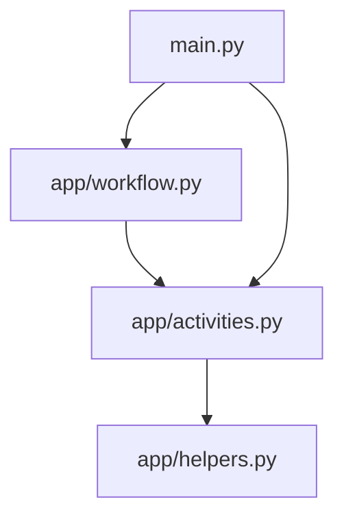

# 📡 Workflows Observability App

A robust application that retrieves and logs workflow run metadata from Atlan. Built with the Atlan Application SDK and Temporal for highly observable and reliable operations.

## Prerequisites

- Python 3.11+
- [uv](https://docs.astral.sh/uv/) package manager
- [Dapr CLI](https://docs.dapr.io/getting-started/install-dapr-cli/)
- [Temporal CLI](https://docs.temporal.io/cli)
- Atlan instance access and API key

### Installation Guides
- [macOS Setup Guide](https://github.com/atlanhq/application-sdk/blob/main/docs/docs/setup/MAC.md)
- [Linux Setup Guide](https://github.com/atlanhq/application-sdk/blob/main/docs/docs/setup/LINUX.md)
- [Windows Setup Guide](https://github.com/atlanhq/application-sdk/blob/main/docs/docs/setup/WINDOWS.md)

## Quick Start


1. **Download required components:**
   ```bash
   uv run poe download-components
   ```

2. **Set up environment variables (see below)**

3. **Start dependencies (in separate terminal):**
   ```bash
   uv run poe start-deps
   ```

4. **Run the application:**
   ```bash
   uv run main.py
   ```

**Access the application:**
- **Web Interface**: http://localhost:8000
- **Temporal UI**: http://localhost:8233

## Features

- Scheduled fetching of Atlan workflow run data
- Supports filtering by date and run status
- Real-time tracking via Temporal UI
- Flexible output options

## Environment Variables

Set up the following environment variables:
```env
ATLAN_BASE_URL=https://tenant.atlan.com
ATLAN_API_KEY=your_atlan_api_key
```

If you plan to export to an object storage service, make sure to update the Dapr `components/objectstore.yaml` file accordingly. For example, if you're using Amazon S3, use the following configuration:"
```yaml
apiVersion: dapr.io/v1alpha1
kind: Component
metadata:
  name: objectstore
spec:
  type: bindings.aws.s3
  version: v1
  metadata:
    - name: bucket
      value: "<BUCKET NAME>"
    - name: region
      value: "<BUCKET REGION>"
    - name: accessKey
      value: "<AWS ACCESS KEY>"
    - name: secretKey
      value: "<AWS SECRET KEY>"
    - name: decodeBase64
      value: "false"
```

## Development

### Stop Dependencies
```bash
uv run poe stop-deps
```

### Run Tests
```bash
uv run pytest
```

## Project Structure



```
workflows_observability/
├── app/                # Core application logic
│   ├── activities.py   # Atlan interaction activities
│   ├── helpers.py      # Atlan helper functions
│   └── workflow.py     # Workflow definitions and orchestration
├── frontend/           # Web interface assets
│   ├── static/        # Static files (CSS, JS)
│   └── templates/     # HTML templates
├── local/              # Local data storage
├── deploy/            # Installation and deployment files
├── main.py             # Application entry point and initialization
├── pyproject.toml      # Dependencies and config
└── README.md           # This file
```

## Workflow Process
1. Initialization: Starts with reading configuration (selectedDate, outputType).
2. Configuration Retrieval: Uses the get_workflow_args activity to fetch input parameters from a state store.
3. Calculates the time window from the current time to selectedDate
4. Fetches all workflow runs with status SUCCESS or FAILED
5. Stores result JSON in ./local/workflows/<date>/<status>/ if outputType == "Local"
6. Completion: Logs a summary and exits gracefully.

## Learning Resources

- [Atlan Application SDK Documentation](https://github.com/atlanhq/application-sdk/tree/main/docs)
- [Atlan developer portal](https://developer.atlan.com)

## Contributing

We welcome contributions! Please feel free to submit a Pull Request.

> [!TIP]
> Want to containerize this app? See the [Build Docker images](https://github.com/atlanhq/atlan-sample-apps/tree/main/README.md#build-docker-images) section in the repository root README for unified build and run instructions.