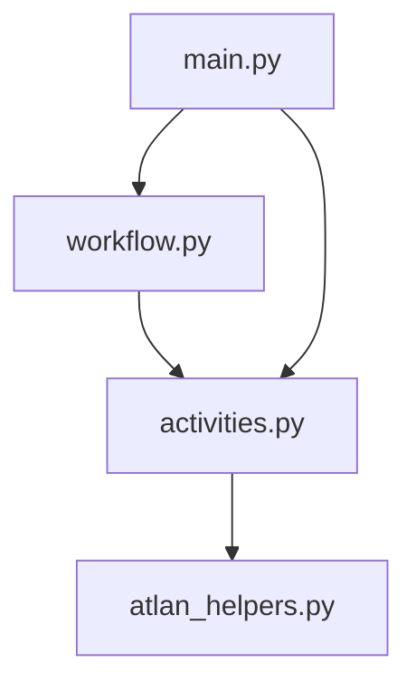

# 📡 Workflows Observability App

A robust application that retrieves and logs workflow run metadata from Atlan. Built with the Atlan Application SDK and Temporal for highly observable and reliable operations.

## Features

- Scheduled fetching of Atlan workflow run data
- Supports filtering by date and run status
- Real-time tracking via Temporal UI
- Flexible output options

## Usage

> [!NOTE]
> To run, first see [README.md](../README.md) for environment setup and prerequisites.

### Run the Observability Application

Launch the application from the root:

```bash
uv run main.py
```

Set up the following env variables:
```bash
export ATLAN_BASE_URL=https://tenant.atlan.com
export ATLAN_API_KEY="..."
```

If you plan to export to an object storage service, make sure to update the Dapr `components/objectstore.yaml` file accordingly. For example, if you're using Amazon S3, use the following configuration:"
```yaml
apiVersion: dapr.io/v1alpha1
kind: Component
metadata:
  name: objectstore
spec:
  type: bindings.aws.s3
  version: v1
  metadata:
    - name: bucket
      value: "<BUCKET NAME>"
    - name: region
      value: "<BUCKET REGION>"
    - name: accessKey
      value: "<AWS ACCESS KEY>"
    - name: secretKey
      value: "<AWS SECRET KEY>"
    - name: decodeBase64
      value: "false"
```

### Access the Application
-   **Web Interface**: Open your browser and go to `http://localhost:8000` (or the port configured for `APP_HTTP_PORT`).
-   **Temporal UI**: Access the Temporal Web UI at `http://localhost:8233` (or your Temporal UI address) to monitor workflow executions.

## Project Structure



```
workflows_observability/
├── main.py           # Application entry point and initialization
├── workflow.py       # Workflow definitions and orchestration
├── activities.py     # Atlan interaction activities
├── atlan_helpers.py  # Atlan helper
└── frontend/         # Web interface assets
```

## Workflow Process
1. Initialization: Starts with reading configuration (selectedDate, outputType).
2. Configuration Retrieval: Uses the get_workflow_args activity to fetch input parameters from a state store.
3. Calculates the time window from the current time to selectedDate
4. Fetches all workflow runs with status SUCCESS or FAILED
5. Stores result JSON in ./local/workflows/<date>/<status>/ if outputType == "Local"
6. Completion: Logs a summary and exits gracefully.

## Learning Resources

- [Atlan Application SDK Documentation](https://github.com/atlanhq/application-sdk/tree/main/docs)
- [Atlan developer portal](https://developer.atlan.com)

## Contributing

We welcome contributions! Please feel free to submit a Pull Request.